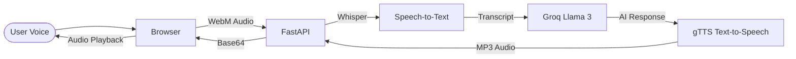

# 💎 Aria AI – Gemini-Inspired Voice Assistant

A premium, production-ready AI Voice Assistant with a stunning Gemini-inspired interface.  
**Talk to Aria** → Get a smart **voice reply** in real-time — all from your browser.

 
*(Replace with your actual hosted screenshot later)*

---

## ✨ Features

- 🎨 **Gemini UI** – Stunning glossy design with glassmorphism and smooth animations.
- 🎙️ **Interactive Voice** – Real-time waveform bars: **Red** (listening) → **Blue** (speaking).
- 🧠 **Dynamic AI** – Powered by **Groq (Llama 3)** with per-user conversation memory.
- 🔊 **Clear Speech** – High-quality voice synthesis via **gTTS**.
- 🚀 **Monolith Architecture** – One FastAPI service hosts both the React frontend and the AI backend.
- 🛡️ **Privacy Focused** – Runs OpenAI Whisper locally for Speech-to-Text.

---

## 🏗️ Architecture



---

## 📁 Project Structure

```
Voice Automation/
├── api.py               # Optimized Monolith (serves UI + AI API)
├── main.py              # Legacy Telegram Bot entry point
├── ai_handler.py        # Groq LLM logic & memory
├── speech_to_text.py    # Local Whisper (handles WebM/OGG)
├── text_to_speech.py    # gTTS synthesis
├── requirements.txt     # Python backend dependencies
├── .env                 # API Keys & Config
└── frontend/            # React + Vite (Gemini UI)
    ├── src/             # Premium Design System
    │   ├── App.jsx      # Voice logic & Waveform animation
    │   └── index.css    # Glossy Vanilla CSS styles
    └── dist/            # Production build (served by api.py)
```

---

## ⚡ Quick Start (Local)

### 1. Prerequisites
- **Python 3.10+**
- **Node.js** (for frontend build)
- **FFmpeg** (required for audio conversion)
  - Windows: `choco install ffmpeg`
  - Mac: `brew install ffmpeg`

### 2. Set Up Environment
Copy `.env.sample` to `.env` and add your keys:
```env
TELEGRAM_BOT_TOKEN=...
GROQ_API_KEY=...
```

### 3. Launch (Two Terminals)

**Terminal A: Backend**
```bash
# Install dependencies
pip install -r requirements.txt
# Run API
python api.py
```

**Terminal B: Frontend**
```bash
cd frontend
npm install
npm run dev
```
Open **http://localhost:5173** and start talking!

---

## 🌐 Deployment (Render)

Deploy this project as a single **Web Service** on Render:

1.  **Connect Repo**: Point to this GitHub repository.
2.  **Environment**: Python 3
3.  **Build Command**:
    ```bash
    cd frontend && npm install && npm run build && cd .. && pip install -r requirements.txt
    ```
4.  **Start Command**:
    ```bash
    python api.py
    ```
5.  **Environment Variables**:
    - `GROQ_API_KEY`: (Your Groq key)
    - `PORT`: `8000`

---

## 📱 Voicemail Mode (Optional)
This project still supports **Telegram Bot** mode for voicemail handling.
- **Run**: `python main.py`
- **Setup**: Forward your missed calls to the Telegram bot as described in the `/voicemails` section.

---

## 🛠️ Tech Stack
- **Frontend**: React, Vite, Framer Motion, Vanilla CSS.
- **Backend**: FastAPI, Uvicorn.
- **AI**: Groq (Llama 3), OpenAI Whisper (Tiny/Base), gTTS.

---

## 📄 License
MIT – Build something awesome! 🚀
